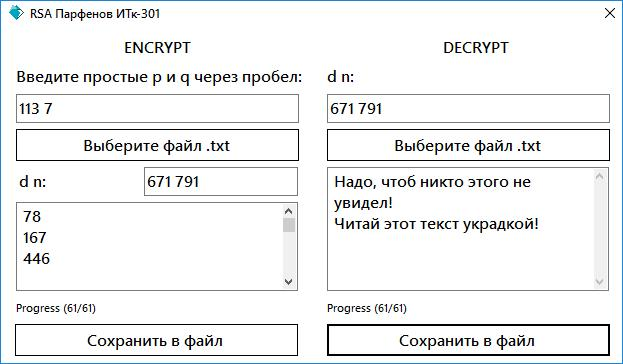

# Криптография. Программа
## Выполнил: Парфенов Н.А. ИТк-301 2020г. РГППУ 
> Написать программу на любом языке программирования по любому алгоритму кодирования, должна кодировать и декодировать. предоставить с исходниками. чем сложнее алгоритм и интерфейс выше балл, за получение текста из файла выше балл. RSA и ассиметричные выше балл. Результирующие работы будут участниками конкурса программ по криптографии на дни науки
## TODO
- [x] Реализовать форму
- [x] Реализовать RSA
- [x] Чтение из файла / Вывод в файл
## Интерфейс

## Проблемы
- При больших p и q очень долго работает
- При маленьких p и q артефакты и ошибки кодирования/декодирования
